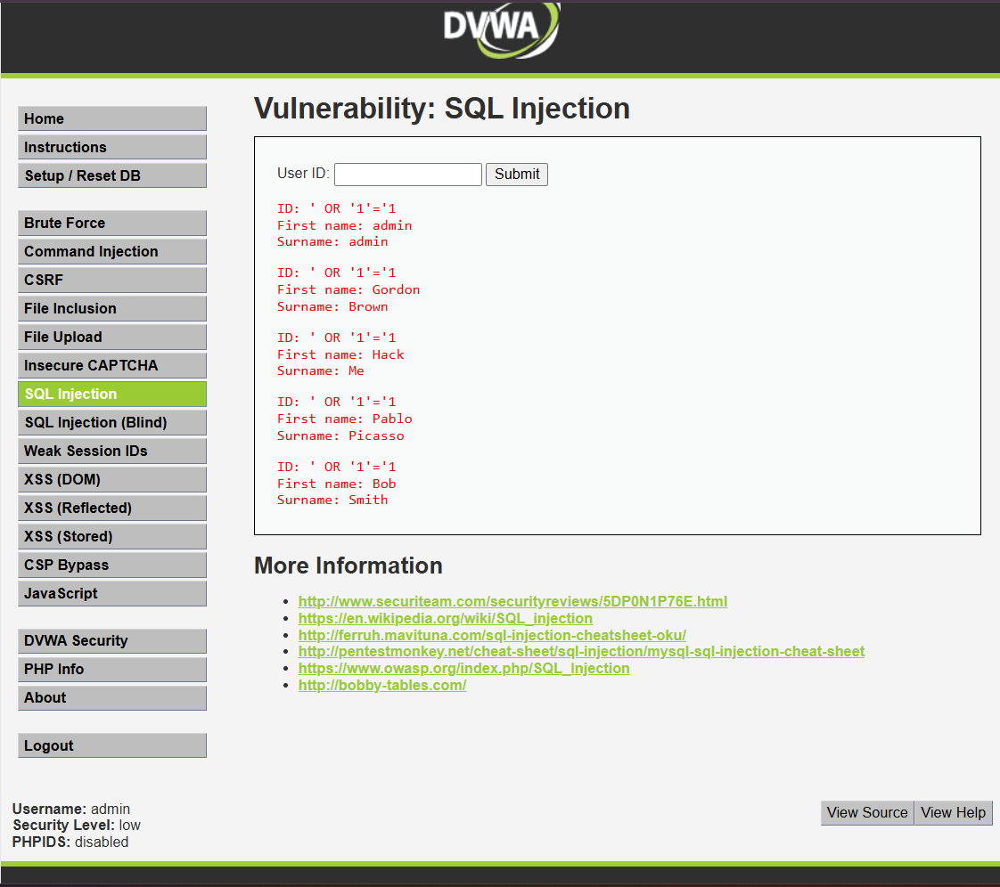

# Reporte de Vulnerabilidad: Inyección SQL (SQLi)

## 1. Evidencia del Ataque
A continuación, se presenta la captura de pantalla que demuestra la explotación exitosa de la vulnerabilidad en el entorno controlado de pruebas (DVWA)[cite: 1].

* **Payload Utilizado:** `' OR '1'='1`[cite: 1]
* **Resultado Visible:** Al ingresar este payload, la aplicación procesó el parámetro sin validarlo y expuso toda la base de datos de clientes en pantalla[cite: 1].

## 2. Explicación Técnica
Esta vulnerabilidad ocurre porque la aplicación web recibe los datos ingresados por el usuario y los concatena directamente dentro de una consulta SQL sin ninguna validación previa. 

Al inyectar la sentencia `' OR '1'='1`, el atacante logra cerrar prematuramente la cadena original de la consulta (con la comilla simple) y añade una condición lógica que siempre es verdadera (`1=1`). Esto invalida cualquier restricción de la cláusula `WHERE`, forzando a la base de datos a ignorar el filtro y devolver absolutamente todos los registros almacenados en la tabla.

## 3. Impacto en Inmobiliaria Terranova y Puntuación CVSS v3.1
* **Contexto de Negocio:** Dentro del "Portal Clientes Terranova Max", un atacante podría ejecutar esta inyección en el formulario de inicio de sesión o en el buscador de propiedades.
* **Impacto Real:** Filtración masiva de los datos más sensibles de la empresa. Se verían expuestos los RUT, contraseñas, correos electrónicos, liquidaciones de sueldo, y montos de pre-aprobaciones de créditos hipotecarios de miles de clientes. Esto conllevaría daños reputacionales irreversibles y graves multas por incumplimiento en la protección de datos personales.

### Cálculo de Gravedad CVSS v3.1
* **Vector de Ataque:** `CVSS:3.1/AV:N/AC:L/PR:N/UI:N/S:U/C:H/I:L/A:N`
* **Puntuación Final:** **8.2 (ALTO)**
* **Justificación:** El ataque se lanza a través de internet (AV:N), requiere baja complejidad (AC:L) y no necesita credenciales previas (PR:N) ni interacción del usuario (UI:N). El impacto en la Confidencialidad (C:H) es total porque expone la base de datos completa.

## 4. Estrategia de Defensa

### Política de Prevención (Diseño Seguro)
* **Uso de Consultas Parametrizadas:** Queda prohibida la concatenación de cadenas (variables de usuario) directas en el código SQL. Toda consulta a la base de datos de la inmobiliaria debe realizarse utilizando sentencias preparadas (*Prepared Statements*), las cuales separan estrictamente el código ejecutable de los datos ingresados por el usuario.

### Control de Mitigación (Defensa Operativa)
* **Principio de Menor Privilegio:** La cuenta de servicio con la que la aplicación web se conecta a la base de datos debe tener los permisos mínimos necesarios. Nunca debe operar con privilegios de administrador (`root` o `sa`), limitando su capacidad a operaciones básicas de lectura/escritura (`SELECT`, `INSERT`, `UPDATE`) solo sobre las tablas estrictamente necesarias, de modo que, si ocurre una inyección, el atacante no pueda borrar tablas o tomar control del servidor de base de datos.