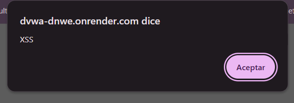

# Reporte de Vulnerabilidad: Cross-Site Scripting (XSS) Reflejado

## 1. Evidencia del Ataque
A continuación, se presenta la captura de pantalla que demuestra la inyección de código malicioso ejecutado en el navegador a través del entorno de pruebas controlado (DVWA).

* **Payload Utilizado:** ``
* **Resultado Visible:** La aplicación web reflejó directamente el texto ingresado en la pantalla y provocó que el navegador interpretara las etiquetas HTML, gatillando una ventana emergente de alerta.

## 2. Explicación Técnica
El Cross-Site Scripting (XSS) Reflejado ocurre cuando una aplicación web recibe datos suministrados por un usuario (generalmente a través de la URL o un campo de búsqueda) y los incluye inmediatamente dentro de la página web de respuesta sin aplicar ningún filtro o codificación. 

Al no sanitizar esta entrada, el navegador de la víctima asume erróneamente que el código (en este caso JavaScript) es una parte legítima de la página enviada por el servidor, procediendo a ejecutarlo en el contexto de la sesión actual del usuario.

## 3. Impacto en Inmobiliaria Terranova y Puntuación CVSS v3.1
* **Contexto de Negocio:** Un atacante podría crear un enlace fraudulento que apunte al "Portal Clientes Terranova Max", incrustando el payload malicioso en la URL. Luego, enviaría este enlace por correo a clientes o ejecutivos simulando ser una oferta de "Descuento en el pie de tu departamento".
* **Impacto Real:** Si un cliente o un ejecutivo de la inmobiliaria con una sesión activa hace clic en el enlace, el script se ejecutará silenciosamente en su navegador y podría robar su cookie de sesión (*Session Hijacking*). Con esto, el atacante suplantaría la identidad de la víctima en el portal, pudiendo alterar datos bancarios para el pago de reservas o aprobar solicitudes fraudulentas.

### Cálculo de Gravedad CVSS v3.1
* **Vector de Ataque:** `CVSS:3.1/AV:N/AC:L/PR:N/UI:R/S:C/C:L/I:L/A:N`
* **Puntuación Final:** **6.1 (MEDIO)**
* **Justificación:** El ataque se realiza de forma remota (AV:N), pero a diferencia de la inyección SQL, requiere obligatoriamente la interacción de un usuario (UI:R) para que haga clic en el enlace malicioso. Al ejecutarse en el navegador de la víctima y no en el servidor, su impacto en la confidencialidad e integridad se limita a los datos de la sesión de ese usuario específico (C:L / I:L).

## 4. Estrategia de Defensa

### Política de Prevención (Diseño Seguro)
* **Codificación de Salida (Output Encoding):** Cualquier dato dinámico ingresado por un usuario que deba ser reflejado en la interfaz de la plataforma web debe ser codificado antes de renderizarse. Los caracteres especiales con significado en HTML (como `<`, `>`, `"`, `'`, `&`) deben ser transformados en sus entidades correspondientes (por ejemplo, `&lt;` y `&gt;`) para asegurar que el navegador los trate estrictamente como texto y no como código ejecutable.

### Control de Mitigación (Defensa Operativa)
* **Atributo HttpOnly en Cookies:** Se debe configurar el servidor web de Inmobiliaria Terranova para que todas las cookies de autenticación incluyan la bandera `HttpOnly`. Este control impide que cualquier script ejecutado en el lado del cliente (como JavaScript) pueda acceder al valor de la cookie, neutralizando el robo de sesiones, que es el impacto más crítico de un ataque XSS.