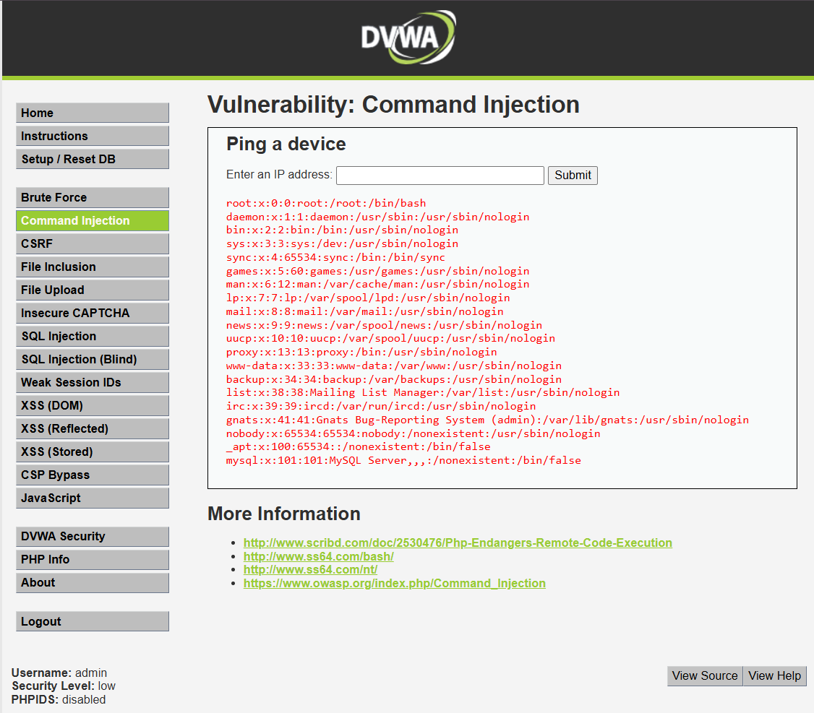

# Reporte de Vulnerabilidad: Inyección de Comandos (Command Injection)

## 1. Evidencia del Ataque
A continuación, se anexa la captura que demuestra la ejecución remota de comandos no autorizados directamente en el sistema operativo del servidor web a través del entorno DVWA.

* [cite_start]**Payload Utilizado:** `127.0.0.1; cat /etc/passwd` [cite: 33]
* [cite_start]**Resultado Visible:** El intérprete del servidor ejecutó primero el comando de red original (el ping a 127.0.0.1) y, debido a la concatenación con el punto y coma (`;`), procesó inmediatamente el comando inyectado `cat /etc/passwd`[cite: 33]. Esto expuso en pantalla el archivo de configuración con el listado de usuarios del sistema operativo subyacente.

## 2. Explicación Técnica
Esta vulnerabilidad crítica se produce cuando la aplicación web necesita realizar una operación a nivel del sistema operativo (por ejemplo, hacer un *ping* a una IP o manipular un archivo) y pasa los datos ingresados por el usuario directamente a funciones del sistema (como `exec()`, `system()`, o `shell_exec()`) sin aplicar una validación ni desinfección rigurosa.

Un atacante aprovecha el uso de metacaracteres propios del intérprete de comandos del servidor (tales como `;`, `&&`, o `|`) para anexar sus propias instrucciones. Al hacerlo, obliga al servidor web a ejecutar estos comandos adicionales con los mismos privilegios que posee la aplicación web.

## 3. Impacto en Inmobiliaria Terranova y Puntuación CVSS v3.1
* **Contexto de Negocio:** Dentro de la intranet del "Portal Clientes Terranova Max", podría existir una herramienta de diagnóstico para verificar la conectividad de los servidores de las distintas salas de venta a nivel nacional.
* **Impacto Real:** Es el escenario más catastrófico. Al comprometer el servidor web, el atacante toma el control de la máquina. Desde allí, puede robar archivos físicos digitalizados (como escrituras y promesas de compraventa en PDF), modificar los planos arquitectónicos, o utilizar el servidor como un punto de apoyo (pivoteo) para inyectar *Ransomware* en la red corporativa interna de la constructora.

### Cálculo de Gravedad CVSS v3.1
* **Vector de Ataque:** `CVSS:3.1/AV:N/AC:L/PR:N/UI:N/S:U/C:H/I:H/A:H`
* **Puntuación Final:** **9.8 (CRÍTICO)**
* **Justificación:** Es un ataque de acceso remoto total (AV:N), de baja complejidad técnica (AC:L), sin necesidad de autenticarse (PR:N) ni requerir interacción de la víctima (UI:N). Al tomar control del servidor subyacente, el impacto en la confidencialidad, la integridad y la disponibilidad es total (C:H / I:H / A:H).

## 4. Estrategia de Defensa

### Política de Prevención (Diseño Seguro)
* [cite_start]**Evitar el uso de llamadas al Sistema Operativo:** Se prohíbe el uso de funciones web que interactúen de forma directa con el intérprete de comandos del sistema operativo[cite: 81]. Si el portal de la inmobiliaria requiere realizar tareas de red o manejo de archivos, los desarrolladores deben utilizar obligatoriamente las APIs seguras y nativas provistas por el lenguaje de programación, las cuales no invocan un *shell* del sistema.

### Control de Mitigación (Defensa Operativa)
* [cite_start]**Aislamiento y Privilegios Mínimos:** El servicio web del portal debe ejecutarse bajo un usuario del sistema operativo con los privilegios más restrictivos posibles (por ejemplo, `www-data` sin permisos de administrador o `root`)[cite: 81]. Además, la aplicación debe estar alojada dentro de un entorno aislado o contenedorizado (como un contenedor Docker o una jaula *Chroot*), garantizando que si un atacante logra inyectar comandos, quede atrapado en ese entorno sin poder afectar la infraestructura central de Terranova.